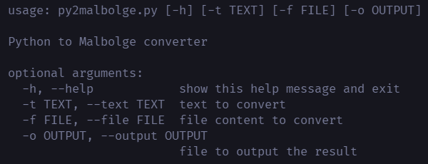

# Python 2 Malbolge

<p align=center>


<a href="./requirements.txt" title="Carrefour"> </a>
<a href="./LICENSE" title="Pode copiar, só não pode dizer que foi tu que fez"></a>
<a href="./py2malbolge.py" title="Hola soy Adobe"> </a>
<a href="./.gitignore" title="Nike Hair"> </a>

_Converting Python code to Malbolge has never been so easy_
</p>

---

## Setup guide

Clone the repository and change your current directory
```console
git clone https://github.com/Vai-Se/Lascar.git
```

```console
cd ./Lascar
```

Then install everything the script needs to run
```console
python3 -m pip install -r ./requirements.txt
```
Now you are *__ready__* to go!

## Using

```console
python3 py2malbolge.py --help
```
